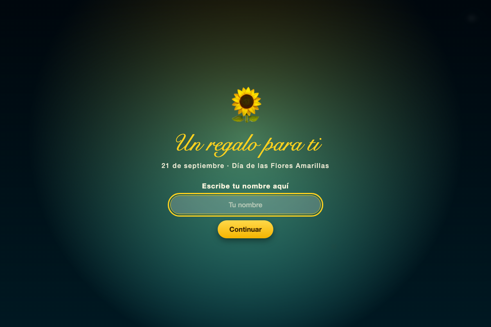

# 🌻 Flores Amarillas — Ramo interactivo de regalo

Ramo animado de girasoles, hecho con HTML, CSS y JavaScript puro (sin frameworks ni dependencias), pensado como una tarjeta-regalo interactiva para el **Día de las Flores Amarillas** (21 de septiembre).

## 📸 Vista previa

**Pantalla de bienvenida** — pide el nombre de quien recibe el regalo:



**El ramo, ya florecido** — 15 girasoles en un macetero con lazo, y una tarjeta con un mensaje que empieza con el nombre ingresado:


## ✨ Qué hace

- **Pantalla de bienvenida en dos pasos**: primero pide el nombre de la persona ("Escribe tu nombre aquí"), y al confirmarlo muestra un saludo animado **letra por letra** — *"¡Feliz Día de las Flores Amarillas, {nombre}!"* — antes de dejar ver el botón **Abrir regalo con música**.
- **Ramo de 15 girasoles** que nacen y crecen: los tallos se estiran, brotan las hojas, se abren los pétalos y aparece el disco central, todo escalonado para que las flores no salgan todas a la vez. Incluye gypsophila de relleno entre las flores.
- **Macetero de terracota** con tierra, sombra y un lazo de regalo.
- **Tarjeta colgante** junto al ramo, con un mensaje amplio que **empieza con el nombre** que la persona escribió.
- **Música de fondo** (`Flores_amarillas.mp3`) en bucle, con un botón para silenciarla o reactivarla. Como los navegadores bloquean el audio automático, la música arranca junto con el botón "Abrir regalo con música".
- Ligero balanceo continuo del ramo y las flores, luciérnagas de fondo y un cielo animado.
- Respeta la preferencia del sistema "reducir movimiento": si está activada, el contenido aparece sin animaciones.

## 🛠️ Tecnologías

- **HTML5** — estructura y arte de las flores/hojas en SVG inline.
- **CSS3** — todas las animaciones (`@keyframes`, `animation-delay` escalonado, variables CSS) y el diseño responsivo en `vmin`.
- **JavaScript vanilla** — sin librerías ni build step.

## 📂 Estructura

```
FLOR AMARILLA/
├── index.html            # Marcado de la escena: ramo, macetero, tarjeta, luces
├── style.css              # Todos los estilos y animaciones
├── intro.js                # Pantalla de bienvenida: nombre + saludo animado
├── music.js                # Reproducción, fundidos y control de la música
└── Flores_amarillas.mp3   # Música de fondo
```

## 🚀 Cómo ejecutarlo

1. Clona el repositorio:
   ```bash
   git clone https://github.com/Juan-inf/AMARILLAS.git
   cd "AMARILLAS/FLOR AMARILLA"
   ```
2. Sírvelo con un servidor local (recomendado, para que la música cargue sin restricciones del navegador):
   ```bash
   python3 -m http.server 8000
   ```
   y abre `http://localhost:8000` en tu navegador.

   También puedes abrir `index.html` directamente haciendo doble clic, pero en algunos navegadores el audio puede comportarse de forma menos consistente que serviéndolo por `http://`.

## 📜 Licencia

Este proyecto está bajo la licencia MIT.

## 🙏 Créditos

Basado en el girasol animado original de **Gustavo Sanchez Villalva**, extendido con el ramo completo, el macetero, la tarjeta personalizada, la pantalla de bienvenida y la música de fondo.
